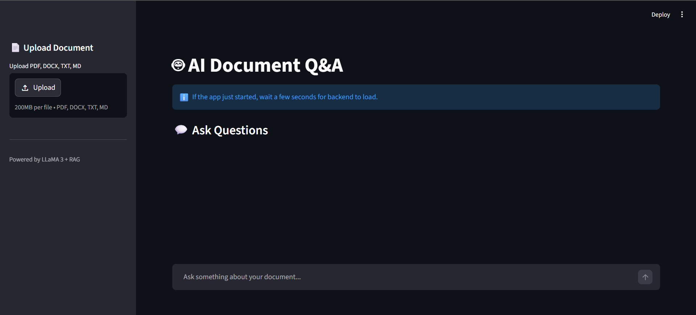

# 🤖 AI Document Q&A System (LLaMA 3 - Local RAG)

An AI-powered system that allows users to upload documents (PDF, DOCX, TXT, MD) and ask questions using a **local LLaMA 3 model via Ollama** with Retrieval-Augmented Generation (RAG).

---


---
## 🚀 Features

- 📄 Upload PDF, DOCX, TXT, MD documents  
- 💬 ChatGPT-style conversational interface  
- 🧠 100% local LLM (no API required)  
- ⚡ Fast semantic search using FAISS  
- 🔍 Source tracking for answers  

---

## 🏗️ Tech Stack

- **Frontend:** Streamlit  
- **Backend:** FastAPI  
- **LLM:** LLaMA 3 (via Ollama)  
- **Embeddings:** sentence-transformers  
- **Vector DB:** FAISS  

---

## 💼 What This Project Demonstrates

### 🧠 Applied AI / LLM Engineering
- Built a Retrieval-Augmented Generation (RAG) system using a local LLM  
- Integrated LLaMA 3 via Ollama for offline inference  
- Designed prompts to reduce hallucination  

### 🔍 Information Retrieval & Vector Search
- Semantic search using FAISS  
- Transformer embeddings for document understanding  
- Optimized chunking and retrieval  

### ⚙️ Backend Engineering
- FastAPI-based backend  
- Document ingestion pipeline  
- Error handling and reliability  

### 🎨 Frontend & UX Design
- Streamlit chat interface  
- Chat history and file upload  
- Backend-safe UX  

### 🏗️ System Design
Upload → Parse → Chunk → Embed → Store → Retrieve → Generate  

### 🧪 Debugging & Reliability Engineering
- Solved race conditions  
- Handled local model constraints  
- Built fault-tolerant flow  

### 🔐 Production Awareness
- Clean structure  
- GitHub-ready setup  
- Environment-safe practices  

---

## 📸 Demo



---

## ⚠️ System Requirements

| Requirement | Minimum |
|------------|--------|
| RAM | 8GB (may lag) |
| Recommended | 16GB+ |
| Disk | 5–10 GB |

---

## ⚙️ Setup Instructions

### 1. Install Ollama  
https://ollama.com/download  

### 2. Pull model
```
ollama pull llama3
```

### 3. Start Ollama
```
ollama serve
```

### 4. Clone repo
```
git clone https://github.com/Mayank-01x/llama3-doc-chat
cd llama3-doc-chat
```

### 5. Setup env
```
python -m venv venv
venv\Scripts\activate
```

### 6. Install deps
```
pip install -r requirements.txt
```

### 7. Run
```
python run.py
```

Open: http://localhost:8501

---

## 🧠 How It Works

1. Upload document  
2. Chunk + embed  
3. Store in FAISS  
4. Retrieve relevant chunks  
5. LLM generates answer  

---

## ⚠️ Limitations

- High RAM usage  
- No persistence  
- Single user  

---

## 🔮 Future Improvements

- Multi-doc support  
- Chat memory  
- Docker  
- Cloud fallback  

---

## 👨‍💻 Author

**Mayank Aggarwal**\
GitHub: https://github.com/Mayank-01x

------------------------------------------------------------------------

## 📄 License

This project is licensed under the MIT License.
